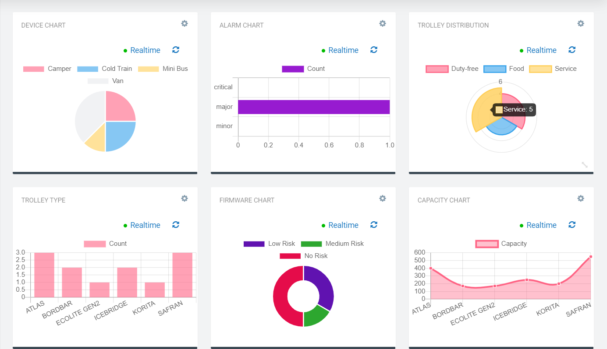

# Deprecation notice

This plugin is not further developed and it might break with upcoming Cumulocity IoT releases.
Use it at your own risk.

The repository is archived but feel free to fork & adapt it to your needs in a new repo.

# Cumulocity Device Chart Widget Plugin 

This Device Chart Widget is the Cumulocity module federation plugin created using c8ycli. This plugin can be used in Application Builder or Cockpit. It displays the chart based on the device-specific inventory data.
By Default the chart displays the count based on the input in the group by field of configuration. But if the input is provided in the value field of the widget configuration it gives the value sum of the provided field from device managed object.

The widget also comes with an inbuilt color picker, which helps one to customize chart/border colors. The charts available include

Vertical Bar Chart

Horizontal Bar Chart

Donut Chart

Pie Chart

Radar Chart

Polar Chart

Scatter Chart (Data set not ideal for this chart)

Bubble Chart (Data set not ideal for this chart)

### Please choose Device Chart Widget release based on Cumulocity/Application builder version:

|APPLICATION BUILDER | CUMULOCITY | DEVICE CHART WIDGET PLUGIN  |
|--------------------|------------|-----------------------------|
| 2.0.x              | >= 1016.x.x| 1.x.x                       |

## Features

*  **Support single device and group devices:** Depends on Deviceid selected in widget configuration.
*  **Supports Alarm Chart:** It displays the Alarm chart if group by is set to c8y_ActiveAlarmsStatus in configuration.
*  **Supports Firmware Chart:** It displays the Firmware chart if group by is set to versionIssuesName in configuration.
*  **Fetch Inner child Devices:** Fetches Inventory data for chid devices only if Fetch innerchild devices is checked in configuration.
*  **Support multiple charts:** Based on chart type in configuration.

## Prerequisite
   Cumulocity c8ycli >=1016.x.x
   
## Installation

### Runtime Widget Deployment?

* This widget support runtime deployment. Download [Runtime Binary](https://github.com/SoftwareAG/cumulocity-device-chart-widget-plugin/releases/download/1.0.3/sag-ps-pkg-device-chart-1.0.3.zip) and install via Administrations --> Ecosystems --> Applications --> Packages 

## QuickStart

This guide will teach you how to add widget in your existing or new dashboard.

1. Open your application from App Switcher

2. Add new dashboard or navigate to existing dashboard

3. Click `Add Widget`

4. Search for `Device Chart` 

5. Select `Target Assets or Devices`

7. Click `Save`

Congratulations! Device Chart is configured.

## User Guide

1. Target Assets/Devices - deviceid/groupid of interest

2. Group By- provide the field name from the device managed object on which you want to group For eg:-

   * To create Alarm chart set the field to c8y_ActiveAlarmsStatus.
   * To create firmware chart set the field to versionIssuesName.
   * To create chart that displays the device type count set the field to type.

3. Value(Optional) -provide the field name from the device managed object whose value sum you want display
   For eg. :-

   * If you just want to display the count for each group by type then leave it empty.
   * To display the capacity for each groupby type then set the field to capacity.
   * To display the quantity for each groupby type then set the field to quantity.

4. Chart Type - type of chart that you want to display.

5. Legend - position of legend you want

6. You can toggle the slider if you want the results for child devices also

One can also select the custom chart color and Border color to beautify the chart, if not default colors will be picked.

------------------------------

This widget is provided as-is and without warranty or support. They do not constitute part of the Cumulocity product suite. Users are free to use, fork and modify them, subject to the license agreement. While Cumulocity GmbH welcomes contributions, we cannot guarantee to include every contribution in the master project.
_____________________
For more information you can Ask a Question in the [TECH Community Forums](https://tech.forums.softwareag.com/tag/Cumulocity-IoT).
